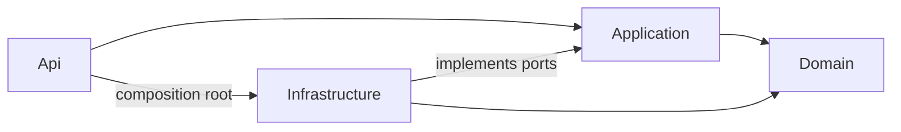

# Modular .NET Backend

## Notifications dan SMTP opsional

Notifikasi disimpan di PostgreSQL. Pengguna dengan izin `manage_notifications` membuatnya melalui `POST /api/notifications` berisi `recipientId`, `title`, `body`, dan `sendEmail` opsional. Penerima yang login dapat memakai `GET /api/notifications`, `PATCH /api/notifications/{id}/read`, dan `GET /api/notifications/stream` untuk SSE. SSE membaca PostgreSQL setiap tiga detik sehingga tetap bekerja di beberapa replica tanpa Redis. Koneksi berakhir setelah 14 menit; perbarui bearer token lalu sambungkan ulang memakai `fetch` dengan header Authorization. Jangan letakkan token di URL.

Saat upgrade, jalankan seeder eksplisit untuk menambahkan `manage_notifications` dan `manage_uploads` ke role admin. Berikan izin secara terpisah untuk role khusus yang sudah ada.

SMTP mati secara default (`Smtp__Enabled=false`). Jika diaktifkan, isi `Smtp__Host`, `Smtp__Port`, `Smtp__Secure`, `Smtp__User`, `Smtp__Password`, dan `Smtp__From`. Kegagalan email tidak menghapus notifikasi; `emailStatus` menjadi `FAILED`. Status `PENDING` dapat tertinggal jika proses berhenti saat mengirim. Untuk jaminan pengiriman email, proyek turunan perlu menambah outbox dan pekerja retry. Banyak klien SSE menambah beban polling PostgreSQL.

[](https://github.com/RidhuanDEV/NET-backend/actions/workflows/ci.yml)

> English README: [README.md](README.md).

Template backend modular monolith yang siap dijalankan dengan ASP.NET Core 10, PostgreSQL, dan library dari penerbit resminya. Mulai dengan Docker Compose, lalu kembangkan modul aplikasi di atas JWT, RBAC berbasis database, audit, upload lokal/S3, rate limit/cache Redis, health check, OpenAPI, dan hook OpenTelemetry.

Cocok untuk tim yang memulai API baru dan membutuhkan struktur bertipe serta kontrol operasional yang jelas. Bisa terlalu kompleks untuk prototipe kecil atau aplikasi yang sejak awal perlu layanan terpisah.

## Pilihan PostgreSQL dan MySQL

PostgreSQL tetap default. Untuk proyek baru melalui CLI terpadu, pilih `--template dotnet --database mysql`; port database MySQL default `3306`, API manual/host `5080`, dan API container `8080`. Initializer native juga menerima `--database=mysql`; template `dotnet new modular-net` menerima `--database mysql`.

Untuk checkout source MySQL, salin `.env.mysql.example` ke `.env`, isi credential, lalu gunakan `docker compose -f compose.mysql.yaml up --build -d --wait` dan `docker compose -f compose.mysql.yaml --profile seed run --rm seeder`. Jangan menjalankan varian PostgreSQL bersamaan untuk proyek yang sama.

Provider MySQL memakai EF Core resmi Oracle dengan migration/context terpisah; PostgreSQL mempertahankan history migrasinya. Baca [DEPENDENCIES.md](DEPENDENCIES.md) untuk lisensi provider MySQL. Mengganti env tidak mengonversi data existing; provider proyek hasil initializer dicatat dan divalidasi. Untuk database remote, gunakan `SslMode=VerifyFull` dan CA tepercaya melalui opsi resmi Connector/NET.

## Quick start

Perlu Git, Docker Desktop/Engine dengan Compose, dan terminal. Untuk build atau menjalankan tool .NET di komputer lokal, pasang [.NET 10 SDK](https://dotnet.microsoft.com/download/dotnet/10.0) melalui [installer resmi Microsoft](https://learn.microsoft.com/dotnet/core/tools/dotnet-install-script).

```sh
git clone https://github.com/RidhuanDEV/NET-backend.git
cd NET-backend
cp .env.example .env
openssl rand -hex 32
```

Salin hasil perintah ke `Jwt__Secret` di `.env`. Isi `POSTGRES_PASSWORD` dan `Bootstrap__Password` dengan nilai kuat yang berbeda. Ganti nilai `CHANGE_ME` S3 sebelum mengaktifkan profil tersebut. Jalankan stack dan seeder:

```sh
docker compose up --build -d
docker compose --profile seed run --rm seeder
```

Compose menjalankan migrasi sebelum API. Seeder dijalankan eksplisit, API tidak mengubah skema atau membuat akun saat startup. Buka [http://localhost:5080/docs](http://localhost:5080/docs) untuk spesifikasi API. Email/password admin mengikuti nilai `Bootstrap__Email` dan `Bootstrap__Password` di `.env`.

Coba login:

```sh
curl -s http://localhost:5080/api/auth/login -H 'Content-Type: application/json' -d '{"email":"admin@example.test","password":"PASSWORD_BOOTSTRAP_ANDA"}'
```

Salin `data.accessToken`, lalu panggil endpoint terlindungi:

```sh
curl http://localhost:5080/api/auth/me -H 'Authorization: Bearer TOKEN_ANDA'
```

Di PowerShell, ganti `cp` dengan `Copy-Item .env.example .env` dan gunakan `curl.exe`. Hentikan layanan dengan `docker compose down`; tambahkan `-v` hanya jika ingin menghapus volume database dan upload.

## Buat project baru

Cara yang disarankan adalah wizard initializer. Wizard memakai engine `dotnet new` resmi, menanyakan pengaturan project, membuat secret acak lokal, lalu restore dependency.

```powershell
pwsh -File scripts/run.ps1 run --project tools/ModularBackend.Initializer -- ../MyBackend
```

Di Linux/macOS:

```sh
python3 scripts/run.py run --project tools/ModularBackend.Initializer -- ../MyBackend
```

Gunakan `dotnet new` langsung jika ingin mengotomasi pilihan atau memasang template di CLI. Paket NuGet belum dipublikasikan; buat dan pasang paket dari clone:

```sh
dotnet pack templates/ModularBackend.Template.csproj -c Release -o artifacts/packages
dotnet new install artifacts/packages/RidhuanDEV.ModularBackend.Template.0.1.0.nupkg
dotnet new modular-net --name MyBackend --output ../MyBackend --port 5180
```

## Fitur

- JWT bearer dengan pemeriksaan akun dan grant terkini dari PostgreSQL.
- Pengelolaan role/permission, soft delete, optimistic concurrency, dan audit mutasi.
- Migrasi dan seeder PostgreSQL terpisah; keduanya tidak berjalan saat API startup.
- Penyimpanan lokal/S3, pemeriksaan signature file, batas ukuran, dan pembersihan orphan.
- Rate limiting bersama dan cache DTO bertipe melalui Redis (opsional).
- OpenAPI hasil generator, health/readiness, CORS, dan instrumentasi OpenTelemetry.
- SDK dan NuGet terkunci, image container dipin, serta CI Windows/Linux.

## Struktur dan batas modul



`Api` menangani HTTP, DTO, middleware, policy endpoint, dan dependency injection. `Application` berisi use case dan port eksplisit. `Infrastructure` mengimplementasikan port dengan EF Core, PostgreSQL, Redis, dan SDK storage. `Domain` menyimpan entity tanpa dependency infrastruktur. Referensi project menegakkan arah dependency saat build; template ini belum memakai framework architecture-test terpisah.

Starter mengelompokkan use case di `BackendService` dan persistensi di `BackendStore`, bukan folder terpisah untuk setiap fitur. Ikuti [panduan menambah modul](docs/ADDING-MODULES.md). Database aplikasi ini dikelola migrasi EF Core sendiri.

## Menambah modul

Ikuti [panduan lengkap](docs/ADDING-MODULES.md). Urutannya:

1. Tambahkan entity domain dan kontrak request/response bertipe.
2. Tambahkan use case aplikasi dan method port persistensi yang eksplisit.
3. Implementasikan port di Infrastructure, lalu konfigurasi constraint/index di `BackendDbContext`.
4. Tambah controller, endpoint ID, registry policy, dan metadata respons OpenAPI.
5. Daftarkan permission baru di seed dan allowlist registry; berikan ke role dengan sadar.
6. Buat migrasi resmi EF dan tambahkan pemeriksaan unit/contract/integration yang sesuai.

## Konfigurasi penting

Salin `.env.example` menjadi `.env` untuk Compose. .NET tidak membaca `.env` secara otomatis; `scripts/run.ps1` dan `scripts/run.py` memuat file itu saat menjalankan perintah lokal. Initializer membuat secret acak baru di `.env` milik project yang dihasilkan. Untuk setup manual, gunakan `openssl rand -hex 32` bagi secret JWT.

| Pengaturan | Fungsi |
| --- | --- |
| `Database__ConnectionString` | Database PostgreSQL khusus aplikasi |
| `Jwt__Secret`, `Jwt__Issuer`, `Jwt__Audience` | Signing dan validasi token; secret minimal 32 byte acak |
| `Bootstrap__Email`, `Bootstrap__Password` | Admin awal yang hanya dibuat oleh seeder eksplisit |
| `Cors__Origins__0` | Origin browser yang diizinkan |
| `Rate__Store`, `Redis__ConnectionString` | Limiter lokal per instance atau limiter bersama Redis |
| `Cache__Enabled` | Mengaktifkan cache DTO melalui Redis |
| `Upload__Storage`, `Upload__Endpoint`, `Upload__Bucket` | Penyimpanan lokal atau S3 |
| `Telemetry__Enabled`, `Telemetry__Endpoint` | Export OTLP ke collector |

Daftar lengkap ada di [.env.example](.env.example) dan [panduan operasi](docs/OPERATIONS.md). Perubahan environment memerlukan restart/redeploy.

## Menjalankan tanpa Docker

Pasang .NET SDK 10.0.401 sesuai `global.json`, siapkan PostgreSQL yang dapat diakses, lalu jalankan:

```powershell
pwsh -File scripts/run.ps1 restore --locked-mode
pwsh -File scripts/run.ps1 run --project tools/ModularBackend.Migrator
pwsh -File scripts/run.ps1 run --project tools/ModularBackend.Seeder
pwsh -File scripts/run.ps1
```

Di Linux/macOS, gunakan `python3 scripts/run.py` diikuti argumen yang sama. Redis/S3 hanya diperlukan saat fitur terkait diaktifkan. Jangan gunakan migrator ke database milik layanan lain.

## Test dan verifikasi

```sh
dotnet restore --locked-mode
dotnet build -c Release --no-restore -warnaserror
dotnet format --verify-no-changes --no-restore
dotnet test ModularBackend.slnx -c Release --no-build
dotnet list package --vulnerable --include-transitive
```

Integration test memerlukan PostgreSQL dan membuat database sementara yang dapat dibuat/dihapus oleh user test. Skenario Redis dan S3 perlu servicenya. Tes tanpa service wajib berstatus inconclusive, bukan lulus. Lihat [workflow CI](.github/workflows/ci.yml) dan [laporan penerimaan lokal](docs/ACCEPTANCE-REPORT.md). Build lokal tidak membuktikan kapasitas atau kesiapan production.

## Keamanan dan batasan

- Access token berlaku 15 menit. `POST /api/auth/login` dan `POST /api/auth/refresh` memberikan refresh token yang dirotasi setiap pemakaian; kirim `{ "refreshToken": "..." }` untuk memperbarui token. Perlakukan refresh token sebagai kredensial dan simpan dengan aman. Server hanya menyimpan hash; tiap token berlaku hingga 30 hari dan keluarga token berakhir setelah 90 hari. Pemakaian ulang mencabut keluarga aktif. Respons user auth hanya berisi `id`, `email`, dan `roleId`.
- Upload dan metadata file dilindungi izin khusus `manage_uploads`.
- `GET /api/upload/{id}` memberi metadata file yang dilindungi, bukan bytes. Alur download/presigned URL belum tersedia.
- Profil S3 di Compose dan CI menggunakan [Adobe S3Mock](https://github.com/adobe/S3Mock), fixture pengujian dengan dukungan sebagian API S3 dan bukan untuk production. Gunakan layanan S3 kompatibel yang dikelola/dipelihara untuk deployment.
- Atur TLS, CORS, proxy tepercaya, secret manager, backup, retention, dan telemetry pada deployment Anda. Untuk beberapa instance API, set `Rate__Store=redis` dan `Rate__InstanceCount` sesuai jumlah replica, lalu isi koneksi Redis yang bisa dijangkau. Validasi startup menolak konfigurasi memory limiter jika jumlah instance yang dideklarasikan lebih dari satu.

Forwarded header diabaikan kecuali IP proxy tepercaya diatur. CORS credentialed nonaktif. Object key upload berupa UUID acak dan signature file divalidasi. Detail policy dan perbedaan kontrak ada di [Operations](docs/OPERATIONS.md) dan [Contracts](docs/CONTRACTS.md).

## Kompatibilitas

Target template adalah [.NET 10 LTS](https://dotnet.microsoft.com/en-us/platform/support/policy), yang saat ini didukung hingga 14 November 2028. `global.json` mempin SDK 10.0.401 dengan `rollForward: disable`; pasang patch SDK tersebut untuk build yang konsisten. Image runtime mempin ASP.NET Core 10.0.12. PostgreSQL 18.3 dan Redis 8.6.1 adalah versi fixture Compose/CI yang diuji, bukan klaim versi minimum semua deployment eksternal.

## Kontribusi, pelaporan keamanan, dan lisensi

Baca [Contributing](CONTRIBUTING.md), [Security policy](SECURITY.md), dan [Changelog](CHANGELOG.md). Rilis template mengikuti SemVer; project yang sudah dibuat tidak otomatis menerima update template. Laporkan kerentanan secara privat melalui [GitHub Security Advisories](https://github.com/RidhuanDEV/NET-backend/security/advisories/new).

Lisensi project: [MIT](LICENSE).
