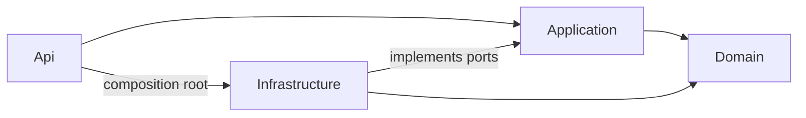

# Modular .NET Backend

[](https://github.com/RidhuanDEV/NET-backend/actions/workflows/ci.yml)

Read this in [Bahasa Indonesia](README.id.md).

A ready-to-run modular monolith backend template built with ASP.NET Core 10, PostgreSQL, and libraries from their official publishers. Start with Docker Compose, then add your application modules on top of the included JWT authentication, database-backed RBAC, audit log, local/S3 uploads, Redis rate limits and cache, health checks, OpenAPI, and OpenTelemetry hooks.

Built for teams starting a new API that want a typed modular structure and explicit operational controls. It may be more than you need for a small prototype, serverless function, or application that requires independent deployable services from day one.

On upgrade, run the explicit seeder to add `manage_notifications` and `manage_uploads` to the admin role. Grant them separately to existing custom roles as needed.

## Quick start

You need Git, Docker Desktop or Docker Engine with Compose, and a terminal. The Compose images pin the tested runtime versions. To build or run .NET tools on your host, install the [.NET 10 SDK](https://dotnet.microsoft.com/download/dotnet/10.0) using [Microsoft's official installer](https://learn.microsoft.com/dotnet/core/tools/dotnet-install-script).

```sh
git clone https://github.com/RidhuanDEV/NET-backend.git
cd NET-backend
cp .env.example .env
```

Generate a JWT secret and paste the result into `Jwt__Secret`. Edit `.env`: set different strong values for `POSTGRES_PASSWORD` and `Bootstrap__Password`. Replace the S3 `CHANGE_ME` values before enabling that profile.

```sh
openssl rand -hex 32
```

Then start the stack and apply the first seed:

```sh
docker compose up --build -d
docker compose --profile seed run --rm seeder
```

Compose applies PostgreSQL migrations before starting the API. Seeding is an explicit step; API startup never changes the schema or creates accounts. Open [http://localhost:5080/docs](http://localhost:5080/docs) for the API specifications. The bootstrap email and password are the values you set in `.env`.

Try login and a protected request (replace the password with your configured bootstrap value):

```sh
curl -s http://localhost:5080/api/auth/login -H 'Content-Type: application/json' -d '{"email":"admin@example.test","password":"YOUR_BOOTSTRAP_PASSWORD"}'
```

Copy `data.accessToken` from the response and use it with a protected endpoint:

```sh
curl http://localhost:5080/api/auth/me -H 'Authorization: Bearer YOUR_TOKEN'
```

On PowerShell, replace `cp` with `Copy-Item .env.example .env` and use `curl.exe` for the sample HTTP request. Stop local services with `docker compose down`; add `-v` only when you intend to delete their database and upload volumes.

## Create a project

The recommended path is the interactive initializer included in the repository. It calls Microsoft's `dotnet new` engine, asks for project settings, generates fresh local secrets and restores packages:

```powershell
pwsh -File scripts/run.ps1 run --project tools/ModularBackend.Initializer -- ../MyBackend
```

On Linux or macOS:

```sh
python3 scripts/run.py run --project tools/ModularBackend.Initializer -- ../MyBackend
```

Use the initializer when you want a guided project setup. Use `dotnet new` directly when you want to automate choices or install the template into the CLI. The NuGet package is not published yet; build and install it from the cloned repository:

```sh
dotnet pack templates/ModularBackend.Template.csproj -c Release -o artifacts/packages
dotnet new install artifacts/packages/RidhuanDEV.ModularBackend.Template.0.1.0.nupkg
dotnet new modular-net --name MyBackend --output ../MyBackend --port 5180
```

## Features

### Notifications and optional SMTP

Notifications are stored in PostgreSQL. An administrator with `manage_notifications` can call `POST /api/notifications` with `recipientId`, `title`, `body`, and optional `sendEmail`. Authenticated recipients can call `GET /api/notifications` for their newest 50 items, `PATCH /api/notifications/{id}/read` to mark one read, and `GET /api/notifications/stream` for SSE. The response contains only `id`, `recipientId`, `title`, `body`, `emailStatus`, `readAt`, and `createdAt`. SSE polls PostgreSQL every three seconds, which works across API replicas without Redis. Connections close after 14 minutes; refresh the bearer token and reconnect using an authenticated `fetch` stream. Do not put bearer tokens in URLs.

`Smtp__Enabled=false` is the default. To enable outbound email set `Smtp__Host`, `Smtp__Port`, `Smtp__Secure`, `Smtp__User`, `Smtp__Password`, and `Smtp__From` in the deployment environment. `sendEmail=true` uses the recipient's stored email address. SMTP failure does not remove the database notification; `emailStatus` becomes `FAILED`. `PENDING` may remain after a process crash during delivery. For guaranteed email delivery, add an application-specific outbox and retry worker. A large number of SSE clients increases PostgreSQL polling load.

- JWT bearer authentication with live account and permission checks from PostgreSQL.
- Role and permission management, soft deletion, optimistic concurrency, and auditable mutations.
- PostgreSQL migrations and seeding as separate commands; neither runs during API startup.
- Local or S3 object storage, file signature checks, size limits, and orphan cleanup.
- Optional shared Redis rate limiting and typed response caching.
- Generated OpenAPI specifications, health/readiness endpoints, CORS controls, and OpenTelemetry instrumentation.
- Locked NuGet dependency graph, pinned SDK, container images, and Windows/Linux CI workflow.

## Structure and module boundaries



`Api` owns HTTP controllers, DTO binding, middleware, endpoint policies, and dependency injection. `Application` owns use cases and explicit ports. `Infrastructure` implements those ports with EF Core, PostgreSQL, Redis, and storage SDKs. `Domain` owns entities and has no infrastructure dependency. The project references enforce the build dependency direction; there is no separate architecture-test package in this template.

The starter currently groups use cases in `BackendService` and persistence in `BackendStore`; it does not claim that every starter feature is already an isolated module folder. Follow the module conventions in [Adding a module](docs/ADDING-MODULES.md) when extending it. The database is dedicated to this application and managed by its EF Core migrations; it is not shared with another service's migration history.

## Add a module

See the full [step-by-step module guide](docs/ADDING-MODULES.md). In short:

1. Add typed domain entities and request/response contracts.
2. Add a focused application use case and explicit persistence port methods.
3. Implement those methods in Infrastructure and configure constraints/indexes in `BackendDbContext`.
4. Add a controller, endpoint ID, route/policy registry entry, and OpenAPI response metadata.
5. Add any new permission to the seed and registry allowlist; grant it to roles deliberately.
6. Create an EF migration with the official `dotnet ef` tool and run unit, contract, and service-backed integration checks.

## Configuration

Copy `.env.example` to `.env` for Compose. .NET itself does not read `.env`; `scripts/run.ps1` and `scripts/run.py` load it for local commands. The initializer writes new random development secrets into the generated project's ignored `.env` file. For manual setup, use `openssl rand -hex 32` for the JWT secret; PowerShell equivalent: `[Convert]::ToHexString([Security.Cryptography.RandomNumberGenerator]::GetBytes(32))`.

| Setting | Purpose |
| --- | --- |
| `Database__ConnectionString` | Dedicated application PostgreSQL database |
| `Jwt__Secret`, `Jwt__Issuer`, `Jwt__Audience` | Token signing and validation; keep the secret private and use at least 32 random bytes |
| `Bootstrap__Email`, `Bootstrap__Password` | Optional initial admin created only by the explicit seeder |
| `Cors__Origins__0` | Allowed browser origin; production origins must be explicit |
| `Rate__Store`, `Redis__ConnectionString` | Choose per-instance memory or shared Redis limiting |
| `Cache__Enabled`, `Redis__ConnectionString` | Enable typed response caching |
| `Upload__Storage`, `Upload__Endpoint`, `Upload__Bucket` | Select local disk or S3-compatible storage |
| `Telemetry__Enabled`, `Telemetry__Endpoint` | Enable OTLP export to your collector |

The complete options and Compose port settings are listed in [.env.example](.env.example) and [the operations guide](docs/OPERATIONS.md). Configuration is read at process start; deploy a restart to apply changes.

## Run without Docker

Install .NET SDK 10.0.401 as pinned by `global.json`, and provide a reachable PostgreSQL database. Redis and S3-compatible storage are needed only when their features are enabled. Set the connection string and secrets in your process environment or `.env`, then run:

```powershell
pwsh -File scripts/run.ps1 restore --locked-mode
pwsh -File scripts/run.ps1 run --project tools/ModularBackend.Migrator
pwsh -File scripts/run.ps1 run --project tools/ModularBackend.Seeder
pwsh -File scripts/run.ps1
```

On Linux/macOS, replace `scripts/run.ps1 ...` with `python3 scripts/run.py ...` and use `python3 scripts/run.py` to start the API. Set `Database__ConnectionString` to the host and database actually used. Never point this migrator at another service's database.

## Test and verify

```sh
dotnet restore --locked-mode
dotnet build -c Release --no-restore -warnaserror
dotnet format --verify-no-changes --no-restore
dotnet test ModularBackend.slnx -c Release --no-build
dotnet list package --vulnerable --include-transitive
```

Integration tests require PostgreSQL and create a temporary database that the test user can create and drop. Redis and S3 scenarios need their matching services. A test without a required service is reported as inconclusive; it does not count as a pass. The checked-in [CI workflow](.github/workflows/ci.yml) defines Windows/Linux quality jobs and a Linux integration job. Local build evidence does not imply deployment or capacity testing. See the [acceptance report](docs/ACCEPTANCE-REPORT.md) for the evidence snapshot and its limits.

## Security and known limits

- Access tokens expire after 15 minutes. `POST /api/auth/login` and `POST /api/auth/refresh` return a rotating refresh token; send `{ "refreshToken": "..." }` to refresh. Treat refresh tokens as credentials and store them securely. The server stores only their hashes, each token lives up to 30 days, and each successful rotation extends its family another 30 days without an absolute cap. Reuse revokes the active family. Auth user responses contain only `id`, `email`, and `roleId`.
- Uploads and file metadata are protected by the dedicated `manage_uploads` permission.
- `GET /api/upload/{id}` returns protected file metadata, not file bytes. There is no download endpoint or presigned URL flow in this starter.
- The optional S3 Compose profile and CI use [Adobe S3Mock](https://github.com/adobe/S3Mock), a test fixture that implements a subset of S3 and is not for production. Use a managed or maintained S3-compatible service for deployment.
- Configure TLS termination, explicit CORS origins, trusted proxy addresses, secrets storage, backups, retention, and telemetry for your deployment. For multiple API instances, set `Rate__Store=redis` and `Rate__InstanceCount` to the replica count, then provide a reachable Redis connection. Startup validation rejects a declared multi-instance memory limiter.

Forwarded headers are ignored unless trusted proxy IPs are configured. Credentialed CORS is disabled. Upload object keys use random UUIDs and allowed file signatures are checked. See [Operations](docs/OPERATIONS.md) and [reference contract differences](docs/CONTRACTS.md) for policy, audit/cache behavior, storage setup, and compatibility details.

## Compatibility

The template targets [.NET 10 LTS](https://dotnet.microsoft.com/en-us/platform/support/policy), currently supported through November 14, 2028. `global.json` pins SDK 10.0.401 with `rollForward: disable` to make builds reproducible; another SDK patch must be installed to build this checkout. Runtime images pin ASP.NET Core 10.0.12. PostgreSQL 18.3 and Redis 8.6.1 are the versions used by the Compose/CI fixtures, not declared minimums for every external deployment. Recheck the supported product versions before upgrading.

## Contribute and report security issues

Read [Contributing](CONTRIBUTING.md) before opening a change. Report suspected vulnerabilities privately using GitHub's [security advisory reporting](https://github.com/RidhuanDEV/NET-backend/security/advisories/new); do not post exploit details in a public issue. See [Security policy](SECURITY.md) for supported versions and response expectations. Template releases follow SemVer; see [Changelog](CHANGELOG.md).

## License

This project is licensed under the [MIT License](LICENSE).

### Unified npm setup

```sh
npx create-ridhuan-backend@latest MyBackend --template dotnet --yes
```

The generated `GETTING-STARTED.md` includes the required env loader, migrations, explicit seed, and chosen port. Defaults are `5080` on the host/manual API and `8080` in containers. `COMPOSE_PROFILES` enables selected development services; run `docker compose up --build -d --wait` to verify service readiness. Custom S3 provider endpoint, region, access key and bucket are retained. All four tool projects are included; renamed projects restore in locked mode without changing lockfile policy.

## PostgreSQL or MySQL

The unified CLI supports `--database postgresql` (default) and `--database mysql`. MySQL defaults to port 3306. Each generated project records the selected provider in `backend-template.json`; its active Compose file and `.env` match that choice. Changing the provider does not convert existing data. PostgreSQL migration history stays intact; MySQL has an independent migration baseline and UTC sessions.

For a source checkout, copy `.env.mysql.example` to `.env`, configure credentials, and run `docker compose -f compose.mysql.yaml up --build -d --wait`. Seed is a separate explicit operation using the same `-f` option. CLI-generated MySQL projects use the ordinary active Compose filename. MySQL bootstrap uses a separate root password and supports quoted/Unicode application passwords without logging them.

For external MySQL, use `SslMode=VerifyFull` and the official Connector/NET CA options in `Database__ConnectionString`. Review the Oracle provider license in [DEPENDENCIES.md](DEPENDENCIES.md). Local Compose is a development fixture. Follow [operations](docs/OPERATIONS.md) for provider-specific backup/restore and failed migration recovery.

## Hardening upgrade

Read [HARDENING-UPGRADE.md](docs/HARDENING-UPGRADE.md) before migrating existing data. It documents sliding refresh/logout, ordered SSE replay, async email worker/outbox, retention commands and optional OpenTelemetry. Local PostgreSQL/MySQL regression and generated-consumer checks pass; [verification evidence](https://github.com/RidhuanDEV/backend-modular/blob/main/docs/BACKEND-HARDENING-TEST-RESULTS.md) records the exact runtime and CI boundaries.
